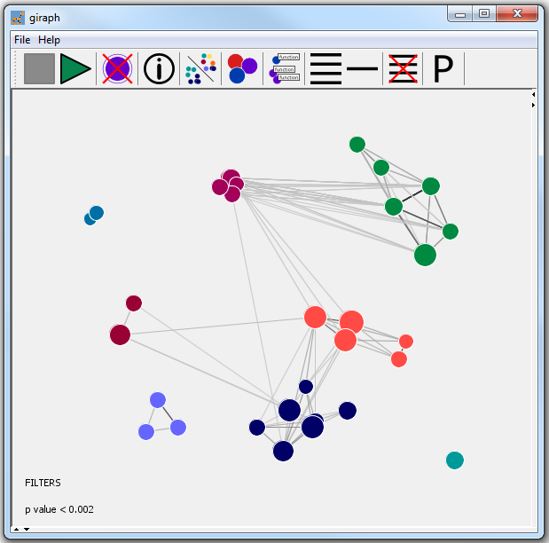

# Giraph
### A tool for visualising gene ontology analysis results

Giraph provides a graphical way to explore and present results of gene ontology and other functional analyses.
There is often a lot of redundancy in the results of functional analysis of gene sets, so Giraph groups similar functional categories together.

### How does Giraph represent the gene sets?

Each circle represents a functional category. The size of the circle is related to the number of genes from the query list that are in the category. The proximity of the circles is related to the proportion of genes that overlap between the sets. 

### What input data is required?

A list of human or mouse gene names can be entered or Giraph can accept the output of functional analyses from other programs. This is currently limited to GOrilla and DAVID result files.
